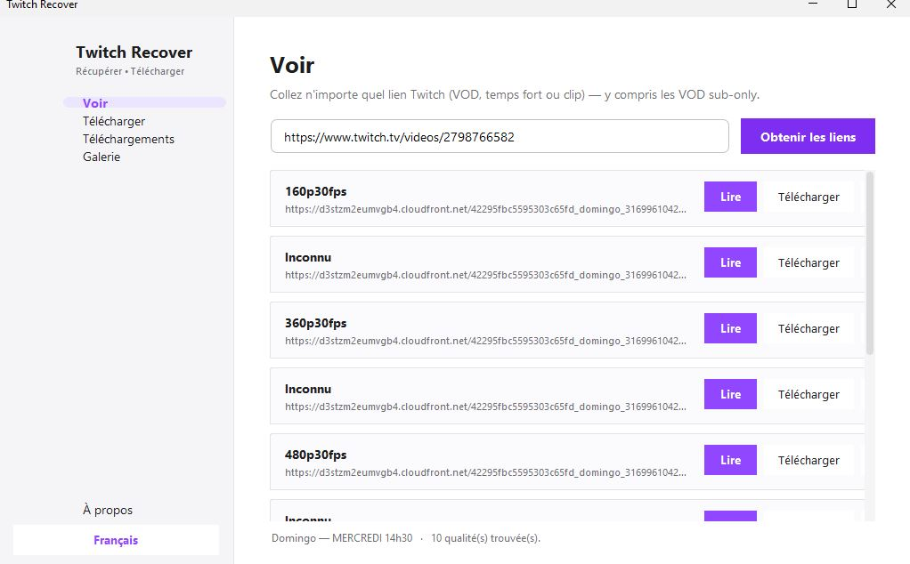
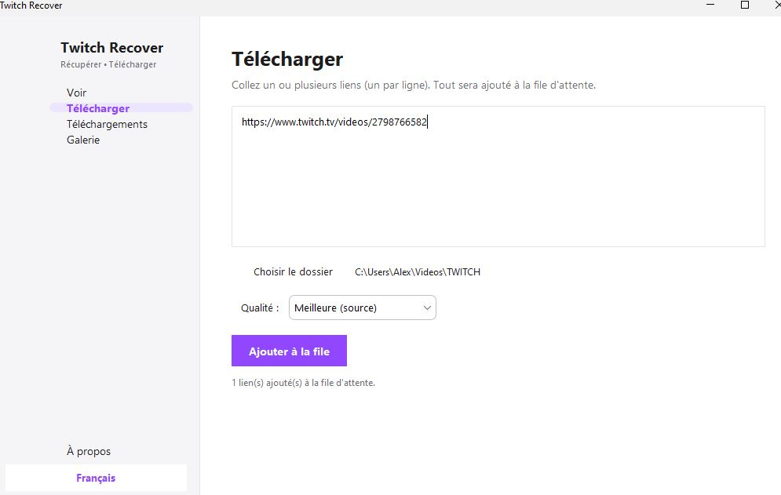
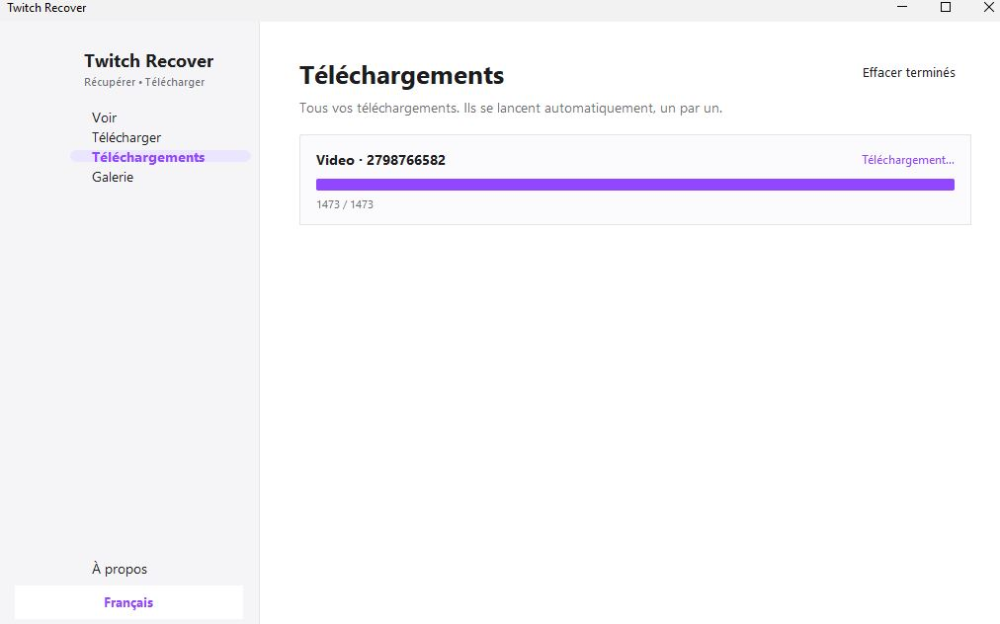
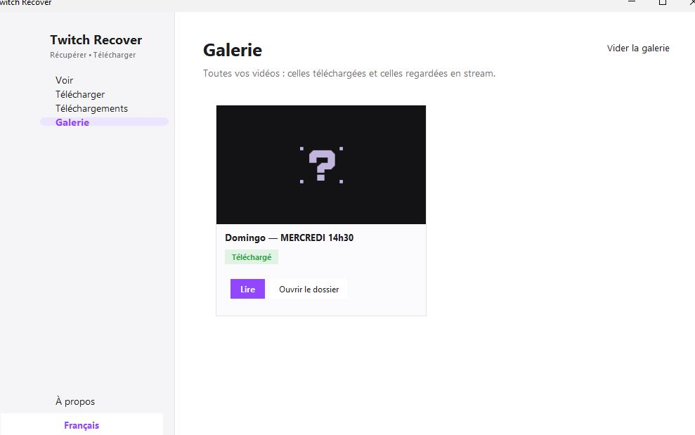

  

  
  
  
  

BNB Smart Chain (BEP-20) : <code>0x77Ad0E3834a4Eea7184e2e7bB44Bec8393Da4312</code> — n'envoyez que des BNB via le réseau BNB Smart Chain.

# Twitch Recover

### A free app to view, recover and download all types of Twitch videos (VODs, clips, streams and highlights) — now with a clean graphical interface.

> ### ➡️ [**Download the latest installer (.exe)**](https://github.com/Alevaldo35/TwitchRecover-2026/releases/latest)
> Run it and you're done: it installs the app and adds a **Start-menu + desktop shortcut**. Nothing else to install.

---

## ⚠️ This is an unofficial patched fork

> **This repository is a community fork that fixes the 2.0 Alpha so it runs and works again in 2026.**
>
> - **Original project & full credit:** [Daylam Tayari (TwitchRecover)](https://github.com/TwitchRecover/TwitchRecover) — all of the original code, design and work belongs to the original author.
> - **Original repository:** https://github.com/TwitchRecover/TwitchRecover
> - **This fork adds bug-fix patches and a clean graphical interface by [Alevaldo35](https://github.com/Alevaldo35).** See [PATCHES.md](PATCHES.md) for the exact list of changes.
>
> Everything below this section is from the original project's README and remains the work of the original author. This fork is distributed under the same GPLv3 license. It is not affiliated with or endorsed by the original author.

### What is this?

Twitch Recover lets you **get the playable links of Twitch videos** (VODs — including sub-only,
highlights and clips), **download** them, **watch them in a built-in player**, and keep a
**gallery** of everything you've watched or downloaded. This fork adds a clean, Apple-like
**graphical interface** (French / English) on top of the original 2.0 Alpha and fixes the
APIs so it works again in 2026.

Features of the GUI:
- **View** — paste any Twitch link (VOD / highlight / clip, auto-detected) and get the links.
- **Download** — queue many videos at once, choose quality and format (**MOV recommended**),
  with a progress bar. Files go to `Videos\TWITCH` by default.
- **Downloads** — the live download queue.
- **Gallery** — a Twitch-style thumbnail grid of everything, marking *Downloaded* vs *Watched*.
- **Built-in player** — plays in-window with quality switching, volume, seek, and an
  "open in VLC" fallback.

### Screenshots

| View | Download |
| --- | --- |
|  |  |
| **Downloads** | **Gallery** |
|  |  |

### How to install & launch (nothing to install)

1. Download this project: green **`Code`** button → **Download ZIP**, then unzip it.
   (Or grab a packaged release if one is provided.)
2. Double-click **`start.bat`**.
   - If Java or VLC are missing, `start.bat` downloads small portable copies automatically
     **the first time** — no need to install Python, Java, or anything.
3. The graphical app opens.

> Alternatives if you already have Java: double-click `run.bat`, or run `java -jar TwitchRecover.jar`.
> The original command-line interface is still available with `java -jar TwitchRecover.jar --cli`.

### Build a standalone `.exe`

Run **`package.bat`** (needs a JDK 17+). It uses `jpackage` to produce a portable
`dist\TwitchRecover\TwitchRecover.exe` bundling its own runtime — zip it and upload it to
GitHub Releases, like the original project's installer.

### Using the original command-line interface (`--cli`)

| Option | What it does |
| ------ | ------------ |
| **3** | **Get the link of a VOD** (including sub-only) — paste the VOD URL, pick a quality, copy the `.m3u8` result. |
| 4 | Download a VOD to a file. |
| 5 | Recover a deleted VOD (within Twitch's retention window). |
| 6–8 | Retrieve / download / recover a highlight. |
| 9–10 | Check for / 'unmute' muted segments of a VOD or highlight. |
| 13–15 | Clip permanent link / download / recover all clips of a stream. |

**Typical use (option 3):** choose `3`, paste a link like
`https://www.twitch.tv/videos/123456789`, choose the quality, then **paste the resulting
`.m3u8` link into VLC** (`Media → Open Network Stream`).

### Rebuilding from source (developers only)

The repo ships a prebuilt `TwitchRecover.jar`. To rebuild after editing the code you need a
**JDK** (not just the runtime): run `build.bat` (Windows) or `build.sh`.

---

## PROJECT UPDATE

After a long absence for which I sincerely apologise, I am back to working on the project and going to resolve issues, patch errors and afterwards rework it.   

**If you want to help contribute to the project or want help with using the program, please join the discord: [https://discord.twitchrecover.com](https://discord.twitchrecover.com).**

A full FAQ is present in the Discord under the `#readme-faq`.

**I am currently in the middle of rewriting Twitch Recover as a whole from scratch in Go to fix many of the fundamental issues and also allow for other projects to utilise its features.**   

**It is my main focus (during my free time obviously) as of right now and doing as much as I can, if you want to help contribute, join the discord.**

---

### There are two current versions available, the alpha of the 2.0 version which has 17 different features and the 1.2 version which is the last current stable version.  
**If you use the 2.0 alpha and experience an issue, please report the issue so I can fix it for the beta and final releases.**  

### Twitch has just started fully deleting a greater percentage of VODs also from their VOD servers when a streamer deletes the VOD. If you cannot find a VOD it is because that one has fallen fate to Twitch's updated deletion process.

## Downloads:  
<break/>  
  
### - [2.0 Alpha](https://github.com/TwitchRecover/TwitchRecover/releases/download/2.0aH/Twitch.Recover.Setup.exe): [https://github.com/TwitchRecover/TwitchRecover/releases/tag/2.0aH](https://github.com/TwitchRecover/TwitchRecover/releases/tag/2.0aH)  
### - [1.2 Release (last stable release)](https://github.com/TwitchRecover/TwitchRecover/releases/download/1.2/TwitchRecover-CLI-v1.2.exe): [https://github.com/TwitchRecover/TwitchRecover/releases/tag/1.2](https://github.com/TwitchRecover/TwitchRecover/releases/tag/1.2)  
  
## Features:
  
| Features  | 1.2 Release  | 2.0 Alpha | 2.0 Beta | 2.0 Final Release |  
| ------------- | ------------- | ------------- | ------------- |------------- |
| GUI  | ❌  | ❌  | ✔  | ✔  |
| Get live stream feeds  | ❌  | ✔  | ✔  | ✔  |
| Download live stream  | ❌  | ❌  | ✔  | ✔  |
| Get VOD feeds  | ✔  | ✔  | ✔  | ✔  |
| Download VOD  | ❌  | ✔  | ✔  | ✔  |
| Recover VOD  | ✔  | ✔  | ✔  | ✔  |
| Retrieve highlight feeds  | ❌  | ✔  | ✔  | ✔  |
| Download highlight  | ❌  | ✔  | ✔  | ✔  |
| Recover highlight  | ❌  | ✔  | ✔  | ✔  |
| Check for muted segments  | ❌  | ✔  | ✔  | ✔  |
| 'Unmute' video  | ✔  | ✔  | ✔  | ✔  |
| Download M3U8  | ❌  | ✔  | ✔  | ✔  |
| Convert TS files  | ❌  | ✔  | ✔  | ✔  |
| Retrieve permanent clip links  | ❌  | 🟡  | 🟡  | 🟡  |
| Download a clip  | ❌  | ✔  | ✔  | ✔  |
| Recover ALL clips from a stream  | ❌  | ✔  | ✔  | ✔  |
| Download chat from live stream  | ❌  | ❌  | ✔  | ✔  |
| Download chat from clip  | ❌  | ❌  | ✔  | ✔  |
| Download chat from VOD/highlight  | ❌  | ❌  | ✔  | ✔  |
| Mass download features  | ❌  | ❌  | ✔  | ✔  |
| Mass recovery features  | ❌  | ❌  | ✔  | ✔  |
| User preferences  | ❌  | ❌  | ✔  | ✔  |
| Multi language support (10+)  | ❌  | ❌  | ❌  | ✔  |
| Direct Twitch Recover URLs  | ❌  | ❌  | ❌  | ✔  |
| Detailed wiki and video tutorials  | ❌  | ❌  | ❌  | ✔  |
| Website  | ❌  | ❌  | ❌  | ✔  |
| Browser extension  | ❌  | ❌  | ❌  | ✔  |

### If there is a feature you don't see above and would like to see, please create a Github issue suggesting the feature.
<break/>  

## 2.0 Alpha Guide:  
  
### Installation:  
**For Windows users please use the installer.**
**For linux and MacOS users, please download the JAR and run it.**
  
1. Download the installer: [https://github.com/TwitchRecover/TwitchRecover/releases/download/2.0aH/Twitch.Recover.Setup.exe](https://github.com/TwitchRecover/TwitchRecover/releases/download/2.0aH/Twitch.Recover.Setup.exe)
2. Run and install the installer.
3. Launch Twitch Recover.
4. Enjoy.

### Can't play M3U8!

You just retrieved a VOD or highlight but when you paste it into VLC it won't load or you can't watch the whole video.
   
#### Check if it has muted segments. Use option 9 of Twitch Recover to check if the video is muted/has muted segments.   
#### If it does, use option 10 to unmute the video and then open that new M3U8 file in VLC and you can watch it. 
  
#### If the M3U8 still won't play, please create a Github issue so I can look into the issue.

This is caused by how the playlist of Twitch M3U8 videos which have muted segments are structured. 
This results in when you try playing those muted segments in VLC (or other video player), it won't be able to reach it and cause it to be unable to play it.  
When unmuted using Twitch Recover, simply open the file in VLC or other similar video players and you should be able to watch it as usual.  
   
### Wfuzz

**If you are attempting to recover clips from a stream, PLEASE utilise the Wfuzz integration and use Wfuzz.**   
**It will shorten your recovery time from literal hours to a couple of minutes.**
**Not using Wfuzz is very heavily unrecommended.**  
   
#### To install and setup Wfuzz for integration with Twitch Recover, please follow the instructions that are on the [Wiki page](https://github.com/TwitchRecover/TwitchRecover/wiki/Wfuzz-Integration).
**- Wfuzz Integration wiki page: [https://github.com/TwitchRecover/TwitchRecover/wiki/Wfuzz-Integration](https://github.com/TwitchRecover/TwitchRecover/wiki/Wfuzz-Integration).**  
**- Wfuzz Integration video tutorial: [https://youtu.be/ZldxgvOrsDE](https://youtu.be/ZldxgvOrsDE).**

## 1.2 Guide:
  
### Installation:
1. Download the exe file for your desired version.
    - [Graphical (GUI) Version (WIP, coming soon)]()
    - [Command Line Version](https://github.com/TwitchRecover/TwitchRecover/releases/download/1.2/TwitchRecover-CLI-v1.2.exe)
2. Run the exe. **Ignore the Windows Defender popup, click more info and run anyway. It is a certificate issue, not a security issue.**
3. Paste the result URL into VLC or another similar video client.  

### Guide:
### Using a Twitch Tracker link:
**You can use the Twitch Tracker link of a stream to directly get the VOD links.**  
**Links must be in the following format: twitchtracker.com/[streamer]/streams/[stream ID]**  
i.e. https://twitchtracker.com/tayarics/streams/40715936990  

Select option 2 and paste the link and you will get the VOD links.

#### Manually inputting the stream information:
1. Select option 1.
2. Input the streamer's name.
3. Input the Stream ID.  
    **The unique Stream ID, not what comes after 'videos/...'.** You can get it a variety of ways but the simplest are using Twitch Tracker or Sully Gnome, they are the string of digits in the stream page's URL.
4. Enter the timestamp of the start of the stream in the 'YYYY-MM-DD HH:mm:ss' format.

#### Brute forcing the seconds:
**Only use this option when you do not have the time in seconds of the stream's start, only the time up to minutes.**
1. Select option 3.
2. Input the streamer's name.
3. Input the Stream ID **(the disclaimer in bold right above also applies)**.
4. Input the timestamp in the same format but set the seconds value to 00.
    **'YYYY-MM-DD HH:mm:00'**

## Credits:
- **[Daylam Tayari](https://github.com/daylamtayari): Developer of Twitch Recover.**  
**Check out my Github to see my other projects, including Twitch related projects:**   **https://github.com/daylamtayari**  
**If you like this and wish to support me, feel free to send a tip via PayPal or Cashapp:  https://paypal.me/daylamtayari or [$daylamtayari](https://cash.app/$daylamtayari)**   
  
- [Saysera](https://twitter.com/Saysera69): Helped my understanding of how some elements of Twitch's backend work.
- [Koolski](https://twitter.com/Koolski_): Designed the logo.
- [arVahedi](https://github.com/arVahedi): His Java M3U8 downloader repository helped me understand how to download M3U8 files.
- [Franiac](https://github.com/Franiac): His Twitch Leecher program helped me figure out a few APIs that I was missing.
- [Lay295](https://github.com/lay295): Helped me figure out how to 'unmute' a VOD.

## Disclaimer:

Twitch Recover is not associated with Amazon, Twitch, Twitch Tracker, Sullygnome, Streamscharts or any of their partners and parent companies.
All copyrights belong to their respective owners.
